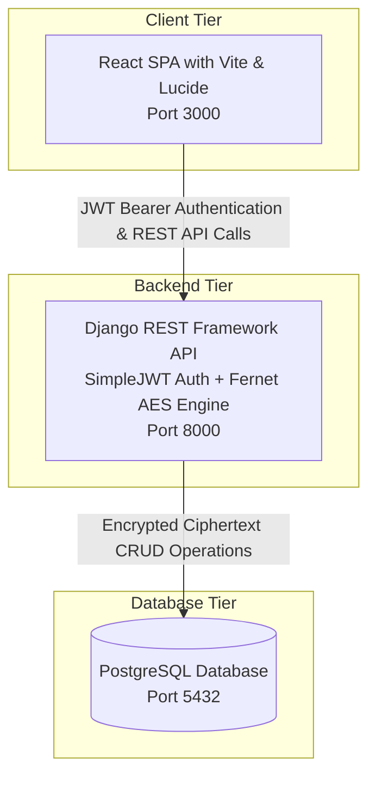

# AegisVault — Secure Password Manager (Django REST + React)

A full-stack, enterprise-grade Password Manager application built with **Django REST Framework**, **PostgreSQL**, **JWT Authentication** (`djangorestframework-simplejwt`), and **AES-256 Fernet symmetric encryption** for at-rest password security, accompanied by a **modern, high-aesthetic React 18+ SPA** built with **Vite** and **Lucide React**.

---

## 🌟 Key Features

### 1. Backend & Security (`/backend`)
- **AES-256 Symmetric Encryption**: Passwords are encrypted on write and decrypted on authorized read using Python's `cryptography.fernet.Fernet`. No plaintext passwords ever touch the database.
- **JWT Authentication**: Full user lifecycle (Registration, Login, Token Refresh, and Token Blacklisting Logout) via `djangorestframework-simplejwt`.
- **PostgreSQL Database Support**: Pre-configured database layer with `psycopg2` and automatic development fallback to SQLite if PostgreSQL is not locally active.
- **Security Audit Engine**: Real-time password entropy evaluation, weak password detection, and duplicate credential analysis.
- **CORS Protection**: Fine-grained cross-origin resource sharing headers for secure frontend API communication.
- **Full Test Coverage**: Automated unit test suite covering authentication, data isolation, and cryptographic integrity.

### 2. Modern React Frontend (`/frontend`)
- **Vite + React 18+**: Fast hot-module replacement and optimized production bundling.
- **Rich Glassmorphism UI**: Deep dark cyber theme with glowing neon gradients, glass cards (`backdrop-filter: blur(20px)`), and smooth micro-animations.
- **Live Password Generator**: Generate cryptographically random passwords with custom length (8–64 chars), character set toggles (A-Z, a-z, 0-9, symbols), and entropy calculations.
- **Decrypted View & 1-Click Clipboard**: Toggle password visibility (`••••••••` vs clear text) and copy username/password with instant toast feedback.
- **Search & Categorization**: Real-time debounce search by title, username, or notes, plus filtering across categories (`Social`, `Banking`, `Work`, `Entertainment`, `Shopping`, `Email`, `Developer`, `General`).
- **Security Health Dashboard**: Visual security score meter (0–100%) highlighting weak, duplicate, and favorite credentials.

---

## 🏗️ Architecture



---

## 🚀 Quick Start

### Option A: Unified Launcher (Recommended)

Run both the Django backend and Vite React frontend concurrently with a single command:
```powershell
python start_servers.py
```
- **Backend REST API**: [http://127.0.0.1:8000/api/](http://127.0.0.1:8000/api/)
- **React Frontend**: [http://127.0.0.1:3000/](http://127.0.0.1:3000/)

---

### Option B: Manual Execution

#### 1. Backend Setup
```powershell
cd backend

# Install dependencies
pip install -r requirements.txt

# Run migrations
python manage.py makemigrations vault authentication
python manage.py migrate

# Run unit tests
python manage.py test

# Start development server
python manage.py runserver 127.0.0.1:8000
```

#### 2. Frontend Setup
```powershell
cd frontend

# Install npm dependencies
npm install

# Start Vite React dev server
npm run dev
```
Open [http://127.0.0.1:3000/](http://127.0.0.1:3000/) in your web browser.

---

## 📡 REST API Reference

### Authentication Endpoints (`/api/auth/`)
| Method | Endpoint | Description | Auth Required |
|--------|----------|-------------|---------------|
| `POST` | `/api/auth/register/` | Register new user & issue initial JWT | No |
| `POST` | `/api/auth/login/` | Obtain JWT `access` & `refresh` tokens | No |
| `POST` | `/api/auth/token/refresh/` | Refresh expired access token | No |
| `GET` | `/api/auth/user/` | Get current authenticated user profile | Bearer Token |
| `POST` | `/api/auth/logout/` | Blacklist refresh token | Bearer Token |

### Password Vault Endpoints (`/api/vault/`)
| Method | Endpoint | Description | Auth Required |
|--------|----------|-------------|---------------|
| `GET` | `/api/vault/passwords/` | List all passwords (supports `?category=`, `?q=`, `?is_favorite=`) | Bearer Token |
| `POST` | `/api/vault/passwords/` | Store a new encrypted password entry | Bearer Token |
| `GET` | `/api/vault/passwords/<id>/` | Retrieve single entry with decrypted password | Bearer Token |
| `PATCH` | `/api/vault/passwords/<id>/` | Update entry fields or password | Bearer Token |
| `DELETE` | `/api/vault/passwords/<id>/` | Permanently delete password entry | Bearer Token |
| `POST` | `/api/vault/passwords/<id>/toggle-favorite/` | Toggle favorite status | Bearer Token |
| `GET` | `/api/vault/passwords/stats/` | Get security metrics & category counts | Bearer Token |
| `POST` | `/api/vault/passwords/evaluate-strength/` | Analyze candidate password entropy | Bearer Token |

---

## 🔒 Security Highlights

1. **At-Rest AES-256 Encryption**: In the database `vault_passwordentry` table, the `encrypted_password` column holds Fernet-compliant base64 ciphertext tokens (e.g. `gAAAAABn...`). Plaintext passwords are never persisted.
2. **User Data Isolation**: Queries in Django are strictly scoped using `PasswordEntry.objects.filter(user=request.user)`, preventing any cross-tenant data leakage.
3. **Stateless JWTs**: Access tokens expire after 60 minutes. Refresh tokens are rotatable and blacklisted upon logout.
